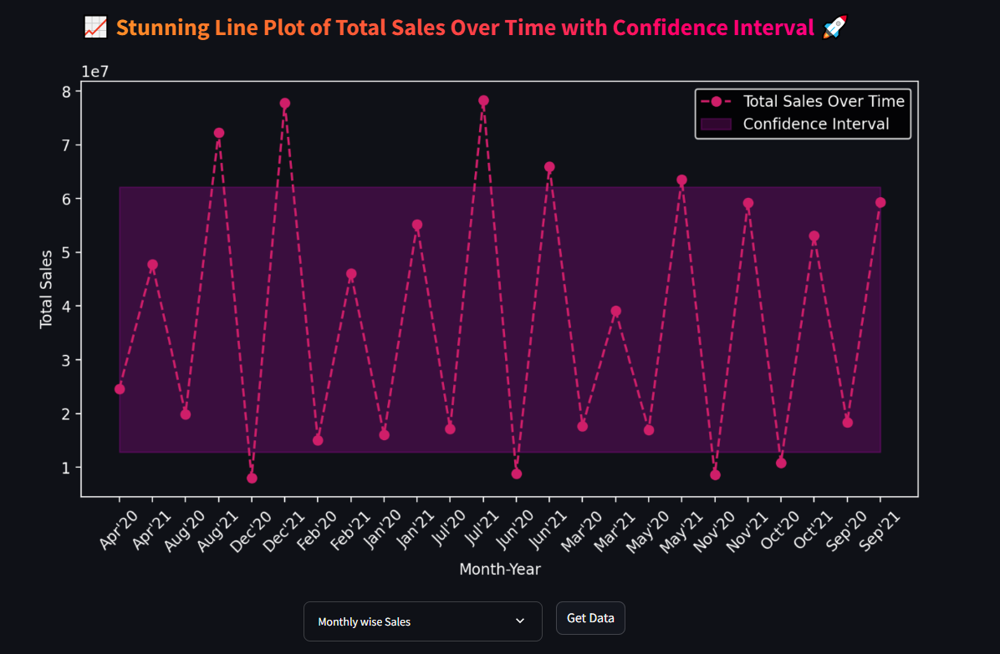
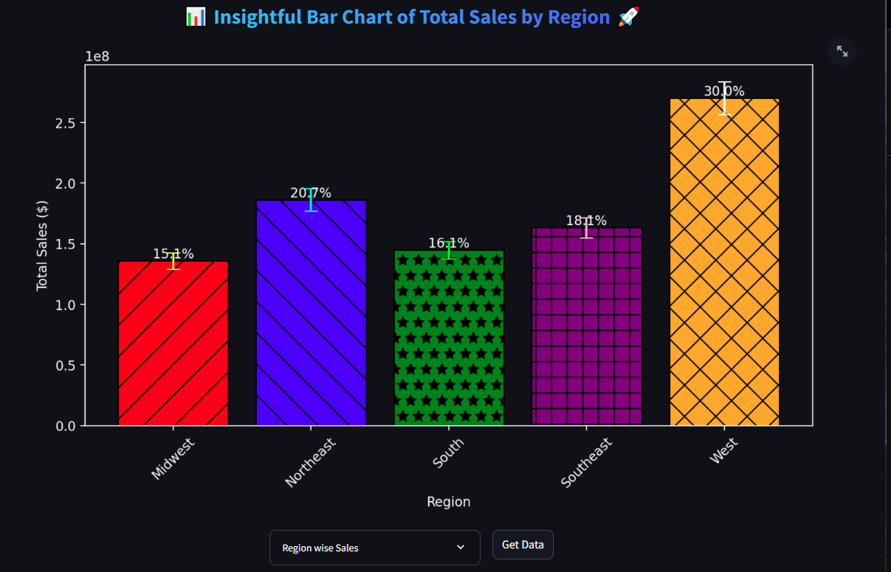
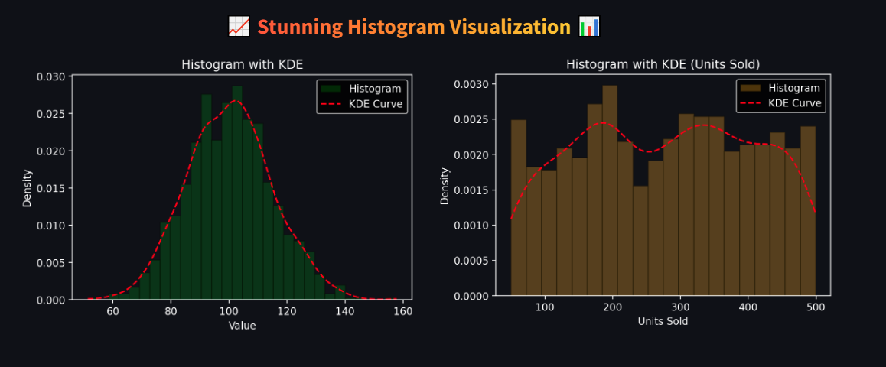
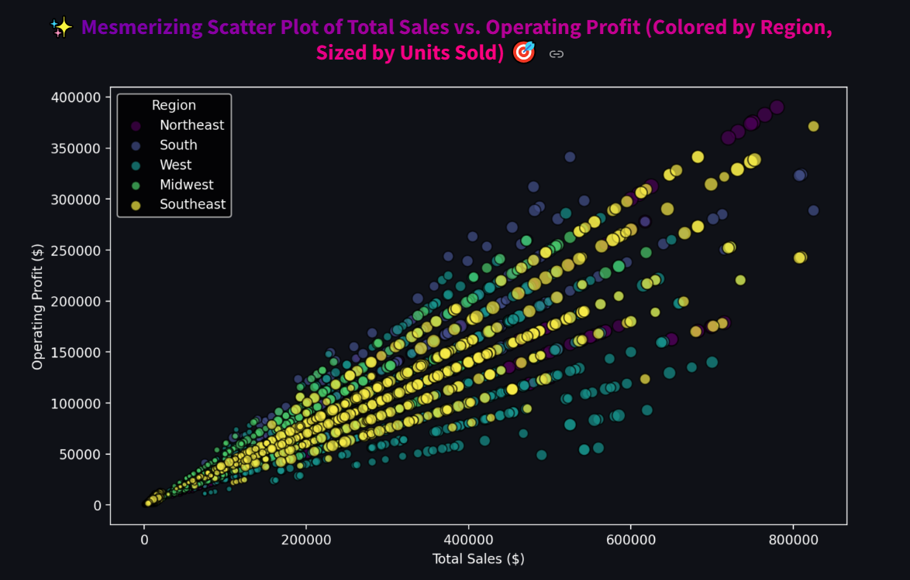
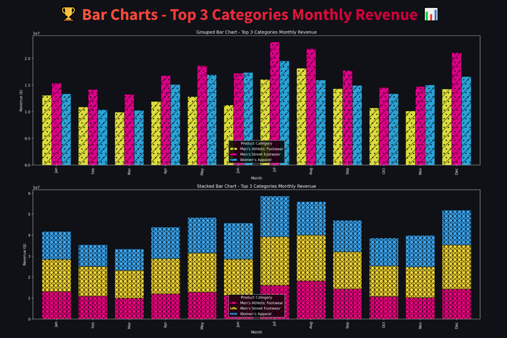
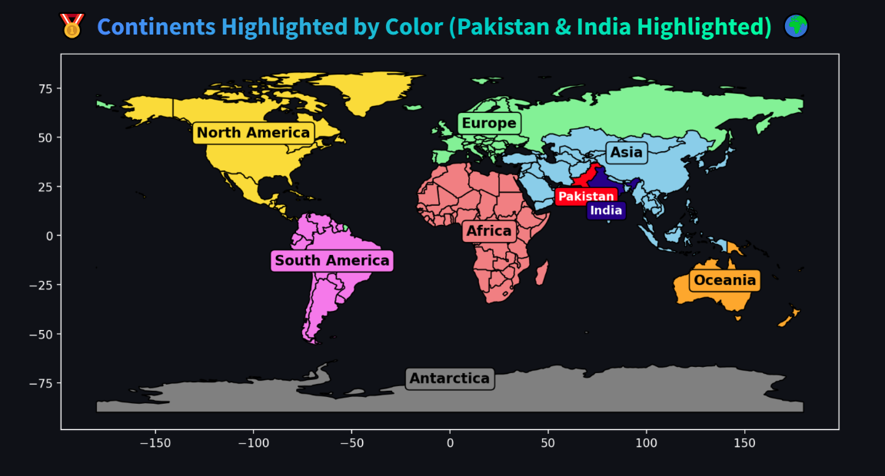
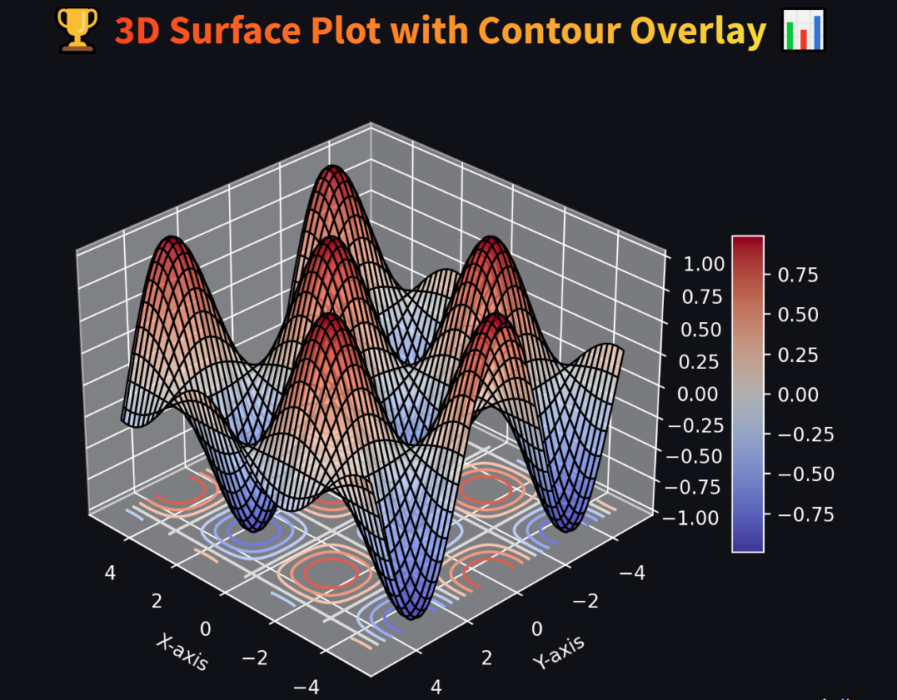
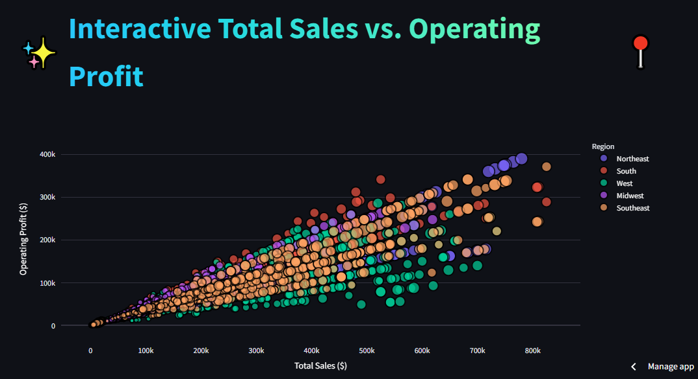
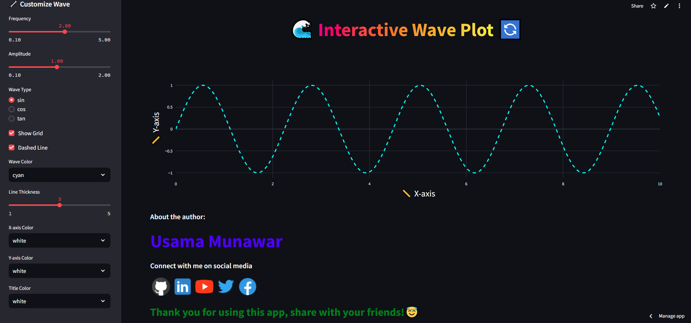

    

---

## 📊 Adidas Interactive Visualization Dashboard


## 🎥 Demo

Here’s a quick look at the system in action 👇


### 🌟 Overview

This **Streamlit-based data visualization app** provides a visually appealing and interactive interface for exploring **Adidas sales data** through multiple advanced plots and dashboards.
It integrates **Matplotlib**, **Plotly**, **GeoPandas**, and **3D visualization** techniques to deliver rich, insightful analytics in an engaging format.

---

### 🚀 Key Features

* **📈 Line Plot:**

  * Displays **Total Sales over Time** with confidence intervals.
  * Built with **dark background styling** for modern aesthetics.

* **📊 Bar Chart (Region-wise Sales):**

  * Compares **Total Sales by Region** with color variations, error bars, and hatch patterns.
  * Percentage labels enhance interpretability.

* **📉 Histogram with KDE:**

  * Shows sales distribution and density using **dual-panel histograms** (Random Data & Units Sold).
  * Uses **Gaussian KDE** for smooth density curves.

* **🎯 Scatter Plot:**

  * Plots **Total Sales vs. Operating Profit**, sized by **Units Sold** and colored by **Region**.
  * Helps identify performance clusters visually.

* **🏆 Grouped & Stacked Bar Charts:**

  * Visualizes **Top 3 Product Categories**’ monthly revenue performance.
  * Both **grouped** and **stacked** charts enhance comparative insights.

* **🌍 World Map Visualization:**

  * Highlights continents by color and **marks Pakistan & India** with standout labels.
  * Uses **GeoPandas** and **Matplotlib** for geospatial visualization.

* **🧠 3D Surface Plot with Contour Overlay:**

  * Illustrates a mathematical surface (`sin(x)*cos(y)`) with 3D depth and contour shading.
  * Interactive 3D perspective for deeper data insights.

* **📍 Interactive Scatter (Plotly):**

  * Dynamic scatter plot linking **Sales**, **Profit**, **Region**, and **Units Sold**.
  * Hover interactivity provides detailed tooltips for each retailer.

* **🌊 Interactive Wave Plot:**

  * A creative feature allowing users to **customize sine, cosine, or tangent waves**.
  * Adjust frequency, amplitude, color, and style directly from the sidebar.

---

### 🧰 Technologies Used

* **Python**
* **Streamlit**
* **Pandas**, **NumPy**, **SciPy**
* **Matplotlib**, **Plotly Express**, **GeoPandas**
* **PIL** for image integration
* **Shapefile-based world map data**

---

### 🗂️ Dataset

* **Source:** `Adidas.xlsx` (Sales data of Adidas products)
* **Sheets Used:**

  * `Sales`: Contains columns like `InvoiceDate`, `Region`, `TotalSales`, `OperatingProfit`, `UnitsSold`, `Product`, and `Retailer`.

---

### 🧑‍💻 How to Run

1. Clone the repository:

   ```bash
   git clone https://github.com/yourusername/adidas-visualization-dashboard.git
   cd adidas-visualization-dashboard
   ```
2. Install dependencies:

   ```bash
   pip install -r requirements.txt
   ```
3. Run the app:

   ```bash
   streamlit run app.py
   ```
4. Upload `Adidas.xlsx` and explore interactive visualizations.

---

### 🖼️ Screenshots












---

### 💡 Future Improvements

* Add **real-time filtering and drill-downs** for more user control.
* Integrate **machine learning forecasts** for future sales prediction.
* Include **regional sales comparisons** through interactive maps.

---

### 👨‍💻 Developer

**Usama Munawar**
📍 MPhil Researcher | Data Scientist | Streamlit Developer  
[](https://github.com/UsamaMunawarr)[](https://www.linkedin.com/in/abu--usama)[](https://www.youtube.com/@CodeBaseStats)[](https://twitter.com/Usama__Munawar?t=Wk-zJ88ybkEhYJpWMbMheg&s=09)[](https://www.facebook.com/profile.php?id=100005320726463&mibextid=9R9pXO)


